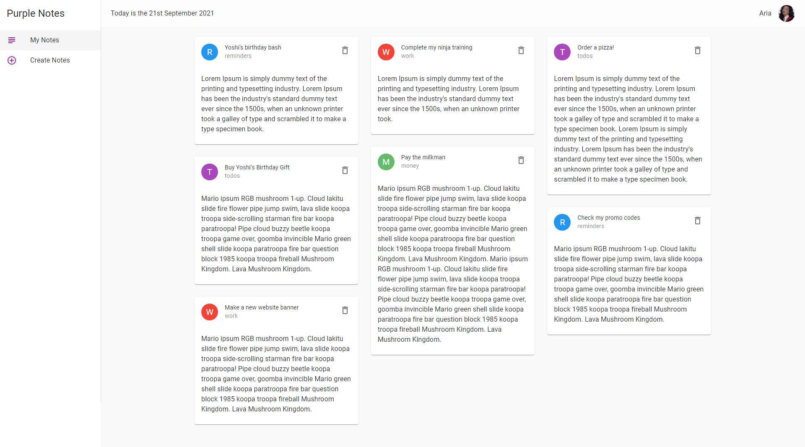

# react-note-app
## Live Code - [Preview](https://next-contentful-blog-delta.vercel.app/)
<!-- ctrl+shift+v : preview -->


---

### Table of Contents
You're sections headers will be used to reference location of destination.

- [Description](#description)
- [How To Use](#how-to-use)
- [Author Info](#author-info)

---

## Live Code - [Preview](https://next-contentful-blog-delta.vercel.app/)

## Description
- This is my first project using Material UI components. It was a great way to learn how to use different components, how to make custom styles to the divs and customize the theme. 
- For the app functionality, a user can create notes in the create page and they will be stored in firebase cloud. You can also delete them with the delete button if you have finished the task. 
- The cards have categories to label the importance of your notes. Example, work, money, todos, reminder or personal.

### Future add ons
- A user can update the todos listed.
- Add a login page with Auth for personalization.


#### Technologies

- CSS
- React
- Material UI
- Vercel


[Back To The Top](Contentful-food-blog)

---
#### Installation
```bash
    Use a command Prompt and type : npm install
    # or
    npm i
```

## How To Use
First, run the development server:

```bash
npm start
# or
yarn start
```

Open [http://localhost:3000](http://localhost:3000) with your browser to see the result.


 
## Author Info
#### [Jane Muchiri ](https://github.com/muchirijane)

- Twitter - [@TracyCss](https://twitter.com/TracyCss)
- Website - [Ui portfolio projects](https://jane.vercel.app/)

[Back To The Top](Contentful-food-blog)

